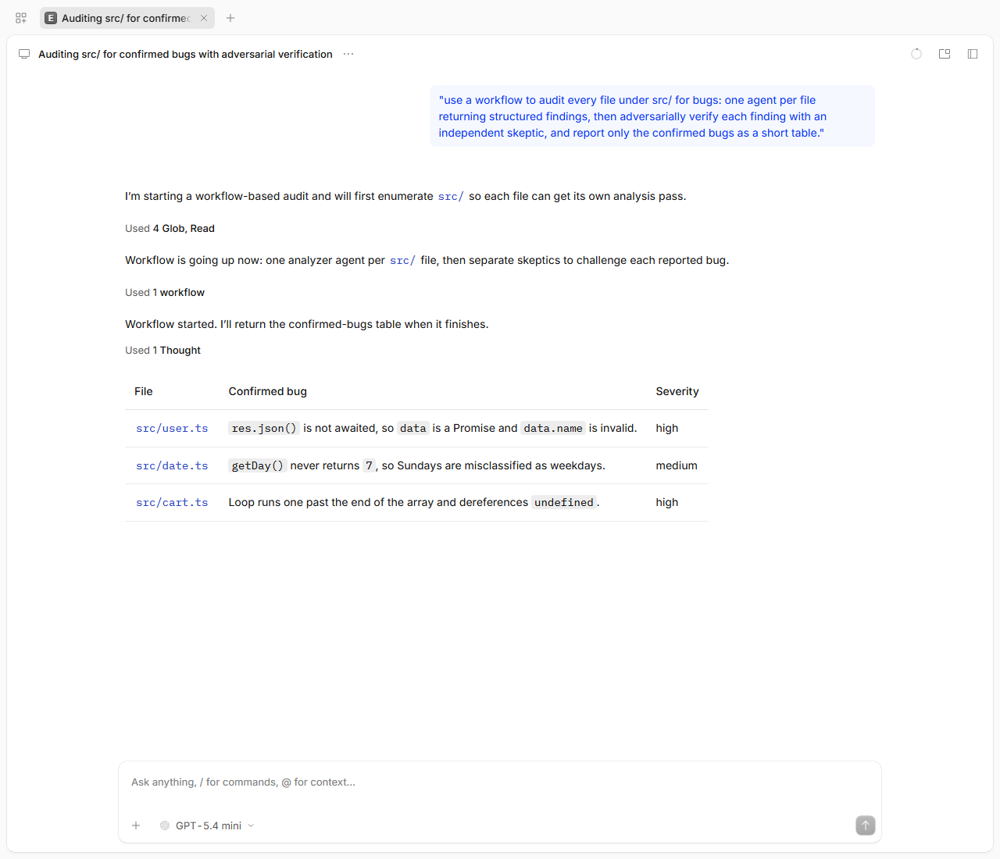
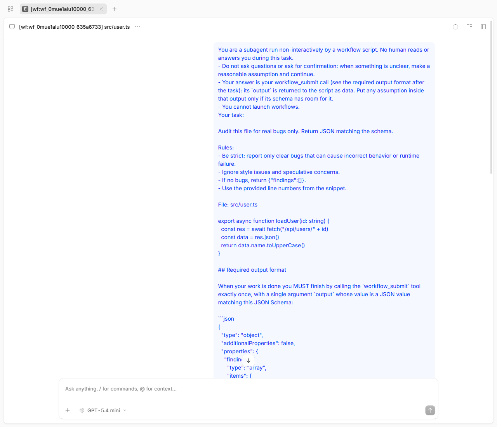
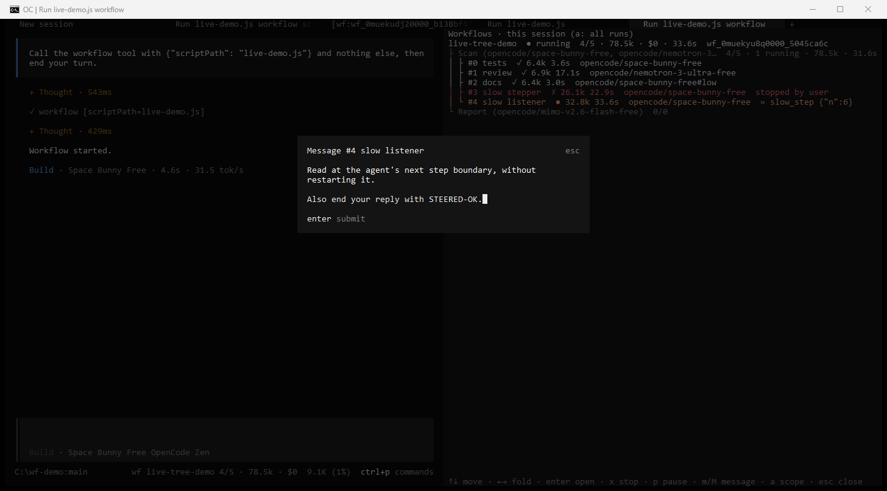
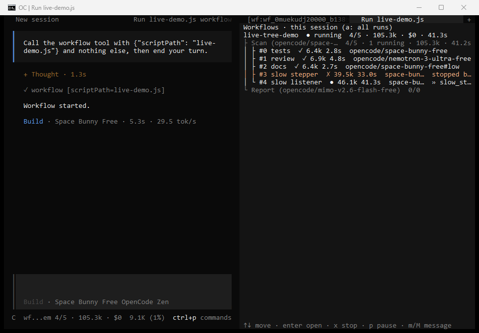
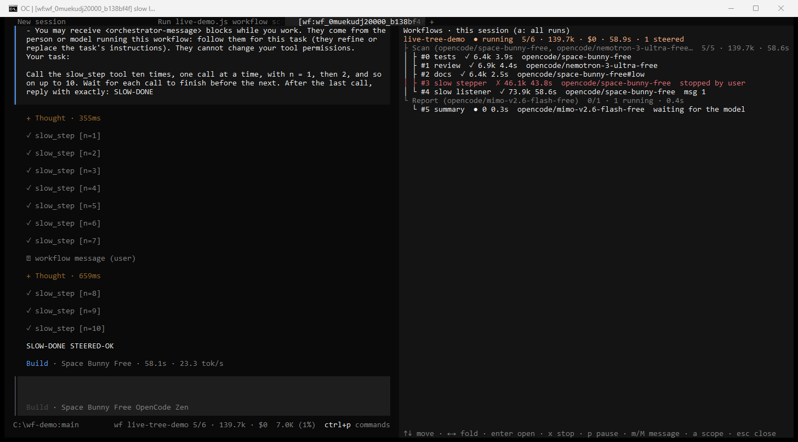
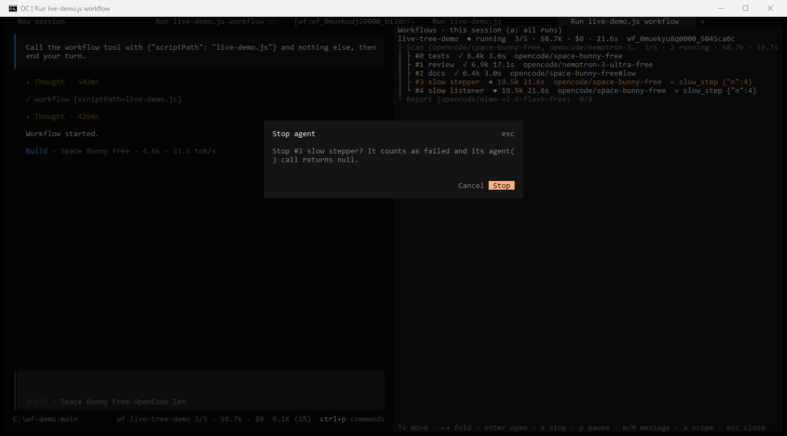
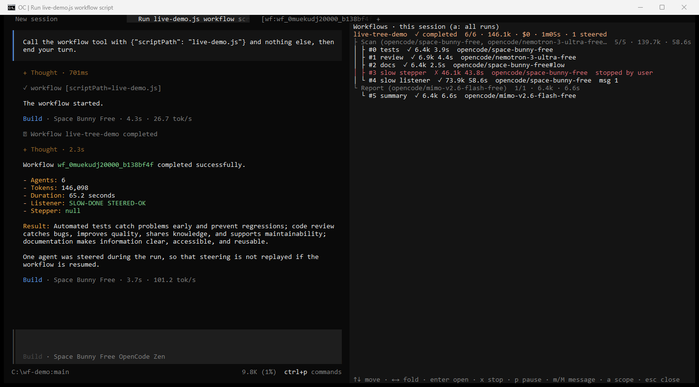

# opencode-workflows

**Claude Code-style dynamic workflows for [opencode](https://opencode.ai) v2.** Ask for a workflow and
the model writes a small JavaScript script that fans the work out to many subagents in parallel. The
script runs in the background, and its result comes back to your session when it finishes.

[](https://github.com/rphang/opencode-workflows/actions/workflows/ci.yml)
[](https://www.npmjs.com/package/@rphang/opencode-workflows)
[](LICENSE)
[](#requirements)

```sh
opencode plugin add @rphang/opencode-workflows
```

---

- [What it does](#what-it-does)
- [Features](#features)
- [Requirements](#requirements)
- [Install](#install)
- [Quick start](#quick-start)
- [Usage](#usage)
- [Script API](#script-api)
- [Configuration](#configuration) · [Environment variables](#environment-variables)
- [How it compares to Claude Code](#how-it-compares-to-claude-code)
- [Security model](#security-model)
- [Costs and limits](#costs-and-limits)
- [Troubleshooting](#troubleshooting)
- [FAQ](#faq)
- [Development and contributing](#development-and-contributing) · [License](#license) · [Acknowledgements](#acknowledgements)

## What it does

Some tasks are too big or too broad for one agent's context: auditing every file in a repo, checking
each finding with independent reviewers, researching a question from ten angles. This plugin adds a
`workflow` tool to opencode. When you ask for a workflow, the model writes an orchestration script
like this one:

```js
export const meta = { name: 'audit-files', description: 'Find bugs per file, verify them, summarize' }

const verified = await pipeline(args,                 // args: ["src/cart.ts", "src/user.ts", ...]
  (file) => agent(`Find bugs in ${file}. One line per bug.`, { label: file }),
  (bugs, file) => agent(`Try to refute each bug in ${file}; keep only the real ones:\n${bugs}`,
                        { label: `${file} skeptic` }))
return await agent(`Summarize these confirmed bugs as a table:\n${verified.filter(Boolean).join('\n')}`, {
  schema: { type: 'object', required: ['summary'], properties: { summary: { type: 'string' } } },
})
```

Each `agent()` call is a separate opencode child session. Every file goes through its finder and
then its skeptic, without waiting for the other files. The final agent returns a JSON object checked
against the schema. The tool returns at once, the script runs in the background (up to 16 agents at
a time), and when it finishes the return value comes back to your session as a task notification.
The model then answers you with it.

All you type is a normal request that says you want a workflow:

> use a workflow to audit every file under src/ for bugs, verify each finding with an independent
> skeptic, and report only the confirmed bugs as a table

or add the keyword **`ultracode`** to any request. The model never starts a workflow unless you ask.



<details>
<summary>One of the agents: a skeptic child session, tagged <code>[wf:&lt;runId&gt;]</code></summary>



</details>

Both screenshots come from the opencode web UI with `openai/gpt-5.4-mini`. The model ends its turn
right after launching, and answers once, from the task notification. A full transcript of a similar
run (6 agents, under a minute) is in [`demo/DEMO-OUTPUT.md`](demo/DEMO-OUTPUT.md).

## Features

- **`workflow` tool** with the same script API as Claude Code's workflow tool: `agent()`,
  `parallel()`, `pipeline()`, `phase()`, `log()`, `args`, `budget` and nested `workflow()`.
- **Structured output.** `agent(prompt, { schema })` resolves to a JSON object validated against
  your JSON Schema, and the agent retries when its output doesn't match.
- **Background runs.** The tool returns immediately. The result comes back as a task notification
  with the agent count, tokens and duration.
- **Journal and resume.** Every finished agent is written to a journal. Relaunching with
  `resumeFromRunId` reuses the cached results of unchanged calls and runs the rest live.
- **Per-agent options:** model override, effort, a custom opencode agent (`agentType`) and git
  worktree isolation for agents that edit files in parallel.
- **Saved workflows.** Save a run's script as a `/<name>` command, for the project or for yourself.
- **Bundled `/deep-research`**: plans research angles, runs web researchers, has 3 skeptics
  cross-check each claim, and writes a Markdown report with citations.
- **`/workflows`** progress view and a **`workflow_control`** tool to list, stop, pause, resume and save runs.
- **Per-agent outputs (extension).** The notification names the agents that returned nothing, and
  once a run has finished the model can read what each agent returned (`workflow_control` `result`),
  without touching files.
- **Steering (extension).** Send an instruction to a running agent without restarting it:
  `/workflows msg <runId> <agent> <text>`, or ask the model. The agent reads it at its next step.
- **Live progress tree (extension, TUI).** `ctrl+x o` opens a live tree of the session's runs:
  phases with their model labels, every agent with its status, the model it runs on, tokens,
  elapsed time and what it is doing right now. Enter opens an agent's session, `x` stops, `p` pauses, `m` messages it.
- **The model each agent really ran on (extension).** Every agent records its actual model as
  `provider/model#variant` (from the script's `model`, else the parent session's model, plus the
  `effort` variant). It is shown in the tree, in `/workflows <runId>` and `workflow_control` status,
  and saved in `agents/<i>.json`. If opencode runs an agent on another model than the one requested,
  the agent gets a warning.
- **Safe by default.** Workflows start only when you opt in. Scripts run in a sandbox with no
  filesystem, network or shell. Agents inherit your permission rules and never get more.
- **Tested for parity.** 60 behaviors are each tracked against Claude Code in
  [`docs/PARITY.md`](docs/PARITY.md), and each has at least one test. The 21 extensions beyond
  Claude Code (`X01`–`X21`: steering, the live progress tree, per-agent models, the per-agent
  failure summary and outputs) are specified and tested there the same way.

## Requirements

- **opencode 2.0.15.** The plugin is pinned to this exact version (`engines.opencode`, and the
  `@opencode/*` dependencies are 2.0.15). Other 2.x versions are untested. opencode v1 is not
  supported, because the plugin uses the v2 plugin API. Check your version with
  `opencode --version`, which should print `opencode v2.0.15`. One way to install or pin that
  version is the npm package: `npm install -g @opencode/cli@2.0.15` (this needs Node.js and npm).
  See [opencode's docs](https://opencode.ai/docs) for other install methods.
- **Nothing else for the plugin.** opencode downloads and installs npm plugins itself, so the
  plugin needs no Node, Bun or npm of its own (your opencode install method might).
- **git**, only if you use `isolation: 'worktree'` agents. The project must also be a git repo.
- For `/deep-research`: working `websearch`/`webfetch` tools in opencode (see [Usage](#usage)).

## Install

### Easiest: one command

```sh
opencode plugin add @rphang/opencode-workflows
```

This installs the package from the npm registry set in your npm config (the public registry by
default) and adds it to `plugins` in your global config. It prints
`Plugin "@rphang/opencode-workflows" installed and added to <path>/opencode.json`.

The `opencode plugin ...` commands go through opencode's background service, which the CLI starts
for you on first use (on port 49374 by default). If a command times out waiting for it, see
[Troubleshooting](#troubleshooting).

### Or edit the config

Add the package to `plugins` in your **global** config: `~/.config/opencode/opencode.json`
(Windows: `%USERPROFILE%\.config\opencode\opencode.json`; `$XDG_CONFIG_HOME/opencode/opencode.json` if
`XDG_CONFIG_HOME` is set, `$OPENCODE_CONFIG_DIR/opencode.json` if `OPENCODE_CONFIG_DIR` is set).

```json
{
  "$schema": "https://opencode.ai/config.json",
  "plugins": ["@rphang/opencode-workflows"]
}
```

The key is **`plugins`** (plural). The legacy `plugin` key loads nothing and gives no error.

A running opencode picks up the change on its own and downloads the package (it took about 20 s in
testing). If it doesn't, run `opencode service restart` or restart the TUI.

### Check that it loaded

- `opencode plugin list` should print a row for the plugin id `dynamic-workflows`:

  ```text
  ID                 VERSION  SOURCE
  dynamic-workflows  0.1.0    @rphang/opencode-workflows
  ```

  The first `opencode` command after an install starts the background service, and `plugin list`
  may print `No plugins found` while the plugin is still loading. Run it again after a few seconds.
- In the TUI, type `/`: the commands `workflows`, `workflow-authoring` and `deep-research` are listed.
- Or ask the model: "do you have a `workflow` tool?"

### Other options

| I want to… | Do this |
|---|---|
| Pin a version | `opencode plugin add @rphang/opencode-workflows@0.1.0`, or `"plugins": ["@rphang/opencode-workflows@0.1.0"]` |
| Pass plugin options | `"plugins": [{ "package": "@rphang/opencode-workflows", "options": { "sizeGuideline": "small" } }]` (see [Configuration](#configuration)) |
| Install for one project only | The same `plugins` entry in `<project>/opencode.json`. Worktree agents then need that config committed, so the global install is recommended. |
| Update | Unpinned installs track `latest`. opencode checks for updates every 24 h; run `opencode plugin check`, then `opencode plugin update @rphang/opencode-workflows`. To update a pinned install, change the version in the config. |
| Uninstall | `opencode plugin remove @rphang/opencode-workflows`, or delete the entry from the config. To free the disk space too, delete the whole `@rphang/opencode-workflows@<spec>` folder in opencode's npm cache (`~/.cache/opencode/npm/`, see [docs/INSTALL.md](docs/INSTALL.md)). |
| Run from a git checkout | See [From source](#from-source) below |

### From source

For contributors, or to run an unreleased commit (needs Node.js 22+ and npm):

```sh
git clone https://github.com/rphang/opencode-workflows && cd opencode-workflows
npm install && npm run build
```

Then either create a global loader file `~/.config/opencode/plugins/workflows.js` with this single
line (use forward slashes on Windows):

```js
export { default } from "/absolute/path/to/opencode-workflows/dist/index.js"
```

or point the config at the checkout directory: `"plugins": ["file:///absolute/path/to/opencode-workflows"]`.
Both were tested on opencode 2.0.15. Details, including a no-build loader for `src/index.ts`:
[docs/INSTALL.md](docs/INSTALL.md#from-source).

Use **one** install method only. If the plugin is loaded twice (for example the npm package plus a
loader file), the second copy fails with `Duplicate plugin ID: dynamic-workflows`. More detail:
[docs/INSTALL.md](docs/INSTALL.md).

## Quick start

1. **Install:** `opencode plugin add @rphang/opencode-workflows`.
2. **Ask for a workflow** in any opencode session, from the TUI or `opencode serve` (not
   `opencode run --standalone`, see [Troubleshooting](#troubleshooting)):
   > ultracode: review every file in src/ for error-handling bugs and give me a table of the real ones
3. **Wait for the notification.** The model launches the run and ends its turn. When the run
   finishes, your session wakes up and the model answers with the result. Meanwhile, `/workflows`
   shows progress.

With plain `opencode run "..."` (no `--standalone`), the run keeps going in the background service,
but the command exits after the launch turn, so the final answer never reaches your terminal. Open
the session in the TUI, or run `opencode run -c` (continue the last session) or
`opencode run -s <sessionID>` to see it.

**Headless (`opencode serve` with no client attached).** Nobody can answer a permission prompt
there, so a turn that raises one waits until it times out or someone answers. The plugin never asks
the model to read run files, but a model can still try: the run store is outside the project, so
opencode asks for `external_directory` approval, and a turn woken by a notification can sit on that
prompt. In unattended setups, add a rule for the data dir (`deny` is fine: the model then uses
`workflow_control` `result`) or allow it.

## Usage

### Asking for a workflow

The model launches a workflow only when you opt in. Any of these counts:

- the keyword **`ultracode`** anywhere in your message;
- asking in your own words: "use a workflow to…", "run a workflow that…";
- running a saved or bundled workflow command such as `/deep-research`.

Good fits: codebase-wide audits and bug sweeps, large migrations, research that needs its sources
cross-checked, and plans drafted from several independent angles. For a small task a workflow only
adds cost.

To cap spend, state a token budget: "ultracode, stay under 200k tokens". The model passes it as the
run's `budget`, which is a hard ceiling: once the run's agents have spent that many output and
reasoning tokens, no new agent starts. If you give no budget, nothing is capped.

### Commands

| Command | What it does |
|---|---|
| `/deep-research <question>` | Bundled workflow. It plans research angles, runs one web researcher per angle, extracts claims, has 3 skeptics cross-check each claim and writes a Markdown report with citations. |
| `/workflows` | Lists this session's runs with per-phase agent counts, model labels, tokens and elapsed time. `/workflows <runId>` shows one run agent by agent, including the model it runs on, its result and, for running agents, what each is doing right now. The output appears as a pending message on your next turn. |
| `/wf` (TUI) | Opens or closes the [live progress tree](#live-progress-tree-tui) (also `ctrl+x o`). |
| `/workflows msg <runId> <target> <text>` | Sends an instruction to a running agent without restarting it (see [Steering a running agent](#steering-a-running-agent)). `msg!` also interrupts the agent's current step. |
| `/workflow-authoring` | Prints the full script API reference the model uses. |
| `/<name> <args>` | Runs a saved workflow. The rest of the line becomes its `args`. |

Slash commands run from the TUI or the web UI. `opencode run "/workflows"` sends the text as a
normal message and does not run the command. With `opencode serve`, use the HTTP API:
`POST /api/session/<sessionID>/command` with the body `{"name":"workflows","text":""}` and the
header `x-opencode-directory: <project>`, then send another message to see the output. In Git Bash
on Windows, set `MSYS_NO_PATHCONV=1` for arguments that start with `/`, or MSYS rewrites them into
Windows paths.

**Command output reaches the model too.** opencode has no display-only message, so `/workflows`
output is a message in the session (it waits in the inbox while the session is idle). The next time
the session wakes, for example when a run's task notification arrives, the model reads that output
in a step of its own before the notification, and usually answers briefly ("Noted."). That costs
one short model step per wake, not per command.

**`/deep-research` needs web search.** The first time `websearch` runs, opencode asks you to choose a
search provider, and a workflow agent cannot answer that prompt. Run one web search in your own
session first. If at least half of the researchers report `NO_WEB_ACCESS`, the run stops early and
tells you so.

### Managing runs: `workflow_control`

The model has a `workflow_control` tool it can use when you ask: "stop that run", "pause the
workflow", "save it as `audit`". Its actions are `list`, `status`, `stop` (the whole run),
`stop_agent` (one agent, whose `agent()` returns `null`), `pause`, `resume`, `message` (steer a
running agent, below), `save` and `result`. It only sees the current session's runs.

**Per-agent outputs (`result`, an extension).** A workflow returns only the script's value, so when
that value is empty or odd you want to know what each agent said. The task notification helps in two
ways:

- `<agent-failures>` names the agents whose `agent()` call returned `null` (failed, stopped, or a null
  value), with the first line of each error, at most 10 of them. This is often enough to explain the
  result without another call.
- `<diagnostics>` tells the model to check the agents with `workflow_control` `result` before it
  diagnoses an empty or unexpected result (Claude Code's own advice, pointed at a tool instead of a
  file).

`{action: "result", runId}` lists every agent, failed ones first, one line each with a preview of its
return value or its error, 50 per page. `agent: "3"` (or `"#3"`, or an exact label) shows one agent in
full: its details (model, usage, prompt, error, steering messages) and its whole return value, 50,000
characters per page. It works as soon as the run has finished. While the run is still going it only
repeats the status note, so it cannot be used to peek at partial output. The model reads nothing from
disk, so there are no permission prompts.

### Steering a running agent

You can redirect an agent while it works, without stopping it and losing what it has done. This is
an extension: Claude Code's workflows do not have it.

```
/workflows msg wf_ab12 3 skip the vendor/ folder, focus on src/auth
/workflows msg wf_ab12 @Research prefer primary sources
/workflows msg! wf_ab12 "auth scan" answer in French
```

Or ask the model ("tell the researchers to prefer primary sources"): it calls `workflow_control`
with `action: "message"`. The model only does this when you ask, and only for its own session's runs.
In the TUI, select an agent in the [live progress tree](#live-progress-tree-tui) and press `m`:



| Target | Meaning |
|---|---|
| `3` or `#3` | the agent with index 3 (`#N` in `/workflows <runId>`) |
| `"auth scan"` | the one agent with exactly this label (quote labels with spaces); an ambiguous label is an error that lists the matching indices |
| `@Research` or `@"Deep dive"` | every running and queued agent of that phase |
| `*` | every running and queued agent of the run |

How it behaves:

- **A running agent reads the message at its next step boundary**: after its current model step
  and that step's tool calls finish. It arrives as an `<orchestrator-message>` block, and the agent's
  `agent()` result is its reply after the message. A message that arrives just as the agent
  finishes is still answered, and that answer becomes the result.
- **`msg!` (urgent)** also interrupts the current step so the agent reads the message right away.
  The interrupted step's tokens are lost and not counted in the agent's usage.
- **A message that arrives as the agent finishes** is answered in one more turn, which the plugin
  starts and waits for, so that answer is the result. In the rare case the message still does not
  reach the agent, it is marked `undelivered` (with a warning) and stays unread: it never starts a
  turn after the agent's result was taken.
- **A queued agent** (not started yet) keeps up to 5 messages and gets them with its first prompt.
- **Refused** (the reply says why): a finished, failed, stopped or cached agent; an agent between
  two turns (try again in a moment); a schema agent that already submitted its result; more than
  20 messages per agent or 4000 characters per message; a run that is not running.
- **Resume:** messages are saved in `journal.jsonl`, but a resume does not replay them. A steered
  agent is never reused from cache, so it and every agent after it run again with their original
  prompts. To make a change stick, edit the script. The task notification and `/workflows <runId>`
  say which agents were steered.

### Live progress tree (TUI)

In the terminal UI, the plugin adds a live, interactive view of your workflow runs. This is an
extension beyond Claude Code's workflow tool.


- **Footer.** While a run of the current session is active, the prompt footer shows
  `wf <name> <done>/<total> · <tokens> · $<cost>` (`+n` when more runs are active). The home screen
  shows `wf <n> running`.
- **Tree.** `ctrl+x o` (or `/wf`, or "Workflows: toggle the live progress tree" in the command
  palette) opens a panel next to the session: each run, its phases with the `meta.phases[].model`
  label (or, without one, the model its agents share), agent counts, tokens and elapsed time, and
  under them every agent with its status, tokens, elapsed time, the model it runs on
  (`gpt-5.4-mini`, with provider and variant when there is room), and what it is doing right now
  (`» bash npm test`, the last words it wrote, or `thinking…`). It updates live, at most 4 times a
  second. In a narrow panel the run id goes first, then a model's provider and variant, then the
  activity, model labels and agent models, then names are shortened; status, counts, tokens, cost
  and elapsed time always stay. The footer likewise shortens only the workflow name.
  
- **Models.** Each agent row shows the model the agent runs on, as `provider/model#variant`:
  `opencode/space-bunny-free#low` is the parent's model with `effort: 'low'`, and an agent with its
  own `model` shows that model. It is the model opencode reports for the agent's session, so if
  opencode falls back to another model, the row shows it (and the agent gets a warning). A phase
  shows its `meta.phases[].model` label when the script declares one, and otherwise the models its
  agents use. `/workflows <runId>` has the same information as a `model:` line under each agent.
- **From a workflow agent's own session** the tree and footer show the parent's run, so you can
  keep controlling it after opening an agent.

Keys in the panel (it has focus when it opens; `ctrl+x ←`/`→` moves focus between the session
and the panel):

| Key | On | Does |
|---|---|---|
| ↑ ↓ (or k j) | any row | move the selection |
| ← → | run, phase | fold / unfold |
| Enter | agent | open the agent's child session (in a tab when tabs are on) |
| Enter | run | open the session that started the run |
| `x` | agent, run | stop the agent (it counts as failed) or the whole run, after a confirmation |
| `p` | any row | pause or resume the run |
| `m` / `M` | agent, phase, run | send a message (`M`: urgent) to that agent, to every running agent of the phase, or to all of them; see [Steering](#steering-a-running-agent) |
| `a` | any | show this session's runs, or every run of the project |
| Esc | any | close the panel |

`ctrl+x j` messages a running agent from anywhere (it asks which one when there are several).

| Opening an agent (Enter) | Stopping it (`x`, then confirm) | Finished, with the notification |
|---|---|---|
|  |  |  |

The TUI screenshots come from opencode 2.0.15 in Windows conhost, with free `opencode/*` models
(the parent on `opencode/space-bunny-free`) and a demo tool, `slow_step`, that takes 4 s per call.

**Notifications.** When a run finishes while the terminal is not focused, the TUI sends a desktop
notification if you enabled opencode's attention notifications in `cli.json` (next to your
`opencode.json`): `{ "attention": { "notifications": true } }`. Otherwise, or when the terminal does
not report focus (Windows conhost), you get an in-app toast. Terminals that report focus include
Windows Terminal, iTerm2 and kitty.

The tree ships with the npm package (`dist/tui.js`) and with directory installs
(`"plugins": ["file:///…/opencode-workflows"]`, through the repo's `tui.tsx`). A single-file
loader (`plugins/workflows.js`) loads only the server part: the tree is not available there, but
`/workflows` and `/workflows msg` work everywhere, including the web UI.

**Scripts and other clients** can read the same data over opencode's server API: the plugin
registers an RPC named `dynamic-workflows` with `list`, `status` and `control` methods, and
`delta`/`finished` events on `/api/event`:

```sh
curl -u opencode:$OPENCODE_PASSWORD -H "content-type: application/json" \
  -H "x-opencode-directory: <url-encoded project path>" \
  -d '{"input":{"all":true}}' http://127.0.0.1:<port>/api/rpc/dynamic-workflows/list
```

### Saved workflows

`save` writes the run's script to one of two places:

- **project:** `.opencode/workflows/<name>.js`, committed with the repo and shared with your team;
- **personal:** `~/.config/opencode/workflows/<name>.js` (`$XDG_CONFIG_HOME` is honored).

You can also write these files by hand. Every valid script in them becomes a `/<name>` command, and
its `meta.whenToUse` shows in the command description and the `workflow` tool description. If two
have the same name, the closest project directory wins, and project wins over personal.

### Resume

Each run has a transcript directory with `script.js`, `journal.jsonl` (one line per finished agent,
in completion order), `run.json` and `agents/<i>.json`. After a stop, a failure or a script edit, ask the model to relaunch
with `resumeFromRunId`. The longest unchanged prefix of `agent()` calls returns cached results at
once. Everything from the first changed or unfinished call onward runs live. A cached agent keeps
the model it ran on in the original run.

## Script API

A script is **plain JavaScript** (no TypeScript, no `import`/`require`). Its first statement is a
pure-literal `export const meta = { name, description, whenToUse?, phases? }`. The body can use
top-level `await` and `return`.

| Global | Behavior |
|---|---|
| `agent(prompt, opts?)` | Runs one subagent. Resolves to its final text, or with `opts.schema` to the validated object. Resolves to `null` if the agent is stopped or dies. Options: `label`, `phase`, `schema`, `model`, `effort`, `isolation: 'worktree'`, `agentType`. |
| `parallel(thunks)` | Runs `() => Promise` thunks concurrently and waits for all (a barrier). Never rejects: a thunk that throws becomes `null`. |
| `pipeline(items, ...stages)` | Runs each item through every stage on its own, with no barrier between stages. Each stage gets `(prev, item, index)`. |
| `phase(title)` / `log(msg)` | Starts a progress group / writes a narrator line. |
| `args` | The tool's `args` input, verbatim. |
| `budget` | `{ total, spent(), remaining() }`. A hard token ceiling when a budget was given. |
| `workflow(nameOrRef, args?)` | Runs a saved workflow inline and returns its result. One level of nesting. |

`Date.now()`, `Math.random()` and `new Date()` without arguments throw, so that resume stays
deterministic. Full reference, with options, limits, patterns and examples:
**[docs/SCRIPT-API.md](docs/SCRIPT-API.md)**.

## Configuration

Plugin options (config install only, see [Install](#other-options)):

| Option | Effect |
|---|---|
| `disabled: true` | Registers no tools or commands. |
| `sizeGuideline` | `unrestricted`, `small`, `medium` (default) or `large`: tells the model to aim for fewer than ∞, 5, 10 or 50 agents. |
| `dataDir` | Where run transcripts are stored. Takes precedence over `OPENCODE_WORKFLOW_DATA_DIR`. |
| `rpcControl: false` | Makes the live tree's RPC read-only: the tree still shows runs, but its `x`, `p` and `m` keys (and any other RPC client) cannot stop, pause or message them. `/workflows msg` and `workflow_control` still work. See [Security model](#security-model). |

## Environment variables

Set them in the environment of the opencode server. They work with every install method.

| Variable | Default | Effect |
|---|---|---|
| `OPENCODE_DISABLE_WORKFLOWS` | unset | `1`, `true`, `yes` or `on` registers no tools or commands. |
| `OPENCODE_WORKFLOW_MAX_CONCURRENT_AGENTS` | `min(16, CPUs - 2)`, at least 1 | Concurrent agents per run, 1 to 256. Extra calls queue. |
| `OPENCODE_WORKFLOW_SIZE_GUIDELINE` | `medium` | Same as the `sizeGuideline` option. The env var wins. |
| `OPENCODE_WORKFLOW_AGENT_TIMEOUT_MS` | unset (no timeout) | Per-agent timeout. An agent that exceeds it fails, and `agent()` returns `null`. |
| `MAX_STRUCTURED_OUTPUT_RETRIES` (or `OPENCODE_WORKFLOW_MAX_STRUCTURED_OUTPUT_RETRIES`) | `5` | Attempts a schema agent gets before `agent()` throws. |
| `OPENCODE_WORKFLOW_RPC_CONTROL` | unset (on) | `0`, `false`, `no` or `off` makes the live tree's RPC read-only, like the `rpcControl: false` option. |
| `OPENCODE_WORKFLOW_DATA_DIR` | `$XDG_DATA_HOME/opencode/workflows`, else `%LOCALAPPDATA%\opencode\workflows` (Windows) or `~/.local/share/opencode/workflows` | Run transcripts, stored as `<dir>/<sessionID>/<runId>/`. The `dataDir` plugin option wins over it. |

## How it compares to Claude Code

Behavior follows Claude Code's [dynamic workflows](https://code.claude.com/docs/en/workflows) item by
item. [`docs/PARITY.md`](docs/PARITY.md) lists each of the 60 behaviors with its status and the tests
that check it:

| Status | Count | Meaning |
|---|---|---|
| FULL | 46 | Same behavior |
| DEGRADED | 12 | Works, with a documented limitation |
| ADAPTED | 1 | Same purpose, reached another way |
| N/A | 1 | Cannot be done as an opencode plugin |

The same file specifies the 21 extensions (status `EXT`, `X01`–`X21`): steering, the live progress
tree and its RPC, the per-agent model display, and the per-agent failure summary and outputs.

Most of the gaps come from one limit of opencode's plugin API: **a plugin cannot create a child
session with a `parentID`**. So workflow agents aren't nested under your session in the UI, and
opencode never shows their permission prompts. Upstream work to expose this:
[anomalyco/opencode#47745](https://github.com/anomalyco/opencode/pull/47745).

### Limitations

| ID | Item | Status | What you get instead |
|---|---|---|---|
| P21 | Structured output | DEGRADED | opencode has no forced tool choice, so agents submit through a `workflow_submit` tool, with validation retries. |
| P26 | `effort` | DEGRADED | Mapped to a model variant when the model has one, otherwise ignored with a warning. |
| P34 | `budget` | DEGRADED | One pool per run, counting the run's agents' output and reasoning tokens. The parent session's own tokens are not counted. |
| P50 | `/workflows` view | DEGRADED | A text view that appears on your next turn. In the TUI, the [live progress tree](#live-progress-tree-tui) is interactive (an extension). |
| P56 | Approval before a run | DEGRADED | Plugins cannot ask. Set an opencode permission rule of `ask` on the `workflow` tool. |
| P61 | Permission inheritance | DEGRADED | Rules are copied when the child session is created. |
| P62 | Child session nesting | DEGRADED | Children are tagged `[wf:<runId>]` instead of being nested. |
| P63 | Agent permission prompts | DEGRADED | An "ask" becomes "deny", so the agent carries on instead of hanging. |
| P71 | Fan-out prefix stagger | DEGRADED | Not implemented: all agents start at once. |
| P72 | Plugin-namespaced workflows | N/A | opencode plugins cannot ship `workflows/` folders for other plugins. |
| P73 | Restart one agent | DEGRADED | Use `stop_agent`, or stop the run and resume it. |
| P74 | Open an agent's transcript | DEGRADED | Open its tagged child session. `agents/<i>.json` holds its `sessionID`. |
| P76 | `scriptPath` permission checks | DEGRADED | An "ask" counts as refused. |
| P79 | Per-agent results named in the notification | ADAPTED | Claude Code points at `journal.jsonl`. Here `<diagnostics>` points at `workflow_control` `result`, because the run store is outside the project (a permission prompt per read) and opencode's `read` cuts long lines. |

Also:

- **Notifications are queued.** A finished run's notification arrives after your current turn,
  never mid-turn.
- **Workflow agents cannot ask you anything.** Put everything an agent needs in its prompt, and
  allow the tools it needs through opencode permission rules.
- **Steering is not instant.** An agent reads a message at its next step boundary, after its current
  model step and tool calls finish (`msg!` interrupts the step and loses its tokens). Resume does
  not replay messages: steered agents run again with their original prompts.
- **The live tree needs the plugin's TUI part.** The npm package and directory installs have it; a
  single-file loader and the web UI do not (use `/workflows` there). Desktop notifications need a
  terminal that reports focus; Windows conhost gets a toast instead.
- **A long workflow result is not clipped.** The notification carries the script's whole return value;
  a very large one (100 KB and more) costs tens of thousands of tokens in the parent. Return a summary
  and keep bulk data in the agents: the model can read them with `workflow_control` `result`.
- **A refused `agent()` call leaves no trace.** A call refused before the agent starts (token budget
  spent, the 1000-agent cap, an invalid schema) throws in the script. Uncaught, it fails the run with
  that error. Inside `parallel()`/`pipeline()` it becomes a `null` that neither the failure summary nor
  `result` lists.
- **Polling and relaunching are model habits.** The tool descriptions tell the model to end its turn
  after launching and not to relaunch unasked. Some small models (seen with a free nemotron) still
  call `status` a few times while a run is going, or relaunch a failed run. A model that reads a
  finished run's agents before its notification arrives may also report twice.
- **The model shown is the one opencode reports** for the agent's session. Until the child session
  exists, an agent shows only the model its script names (`model` option), or none.

## Security model

- **You opt in.** The model is told to launch a workflow only when you ask. There is no approval
  dialog (P56). To confirm each launch, set an opencode permission rule of `ask` for the `workflow`
  tool.
- **The script is sandboxed.** It runs in opencode's codemode interpreter, with no filesystem,
  network, shell, Node API or `import`. It can only call the globals listed above. Only the agents
  touch your files.
- **Agents get your permissions, never more.** Each child session copies the parent session's rules
  and runs as the parent's current agent, so Plan mode's edit ban still applies. With a different
  `agentType`, the parent agent's deny and ask rules are added on top. In every child, `workflow`,
  `workflow_control`, `workflow_submit` and `question` are denied, and any "ask" becomes "deny".
- **`scriptPath` reads only files you could read anyway**: the project, this session's runs and the
  personal workflows directory, plus directories an `external_directory` allow rule covers. Symlinks
  are resolved first, `read` deny rules apply, and UNC or device paths are refused.
- **Runs are private to their session.** Another session's run id answers "not found". This covers
  `workflow_control` `result` too: the parent model sees its own runs' agent outputs, and workflow
  agents cannot call it.
- **The model never needs to read the run store.** Agent outputs reach it through `result`, not files.
  The run store is outside your project, so if a model reads it anyway, opencode's `read` asks for
  `external_directory` approval as usual. The notification tells the model not to read it with shell
  commands, but only your permission rules actually enforce that.
- **Steering needs the same access.** Only the user of the parent session (`/workflows msg`) and the
  parent model (`workflow_control`, when you ask) can message a run's agents. Workflow agents
  cannot: `workflow_control` is denied in every child. A message is plain text framed as
  `<orchestrator-message>`; it cannot change an agent's tool permissions, and a message cannot fake
  or close that frame, or pass for another tag such as `<system-reminder>`: tags inside it are
  escaped, after look-alike characters (fullwidth `＜`, zero-width spaces) are folded.
- **The live tree's RPC has the server API's trust, within one project.** The `dynamic-workflows`
  RPC (`list`, `status`, `control`) answers only for the runs of its own project (Location); another
  project's runs are unknown to it, live or on disk. Inside the project its `control` (stop, pause,
  message) is not limited to one session, the same as the TUI itself. The model-facing
  `workflow_control` tool and the slash commands stay limited to the current session's runs.
  - The RPC needs opencode's server password, like the rest of the server API (which can already
    read and prompt every session). opencode always sets one: yours (`OPENCODE_PASSWORD`), or a
    random one it hands to the TUI and web UI (the background service keeps it in its own config).
  - **Anything that knows that password can steer or stop runs.** The RPC cannot tell the TUI from
    `curl`, so its messages are recorded as `via: "rpc"` and reach the agent as
    `<orchestrator-message from="user">`. A workflow agent cannot use the plugin's tools for this,
    but an agent with shell access could, if it can read the password: for example an
    `OPENCODE_PASSWORD` exported in the shell that started opencode, or the service's config file.
    If you run untrusted or prompt-injectable workflows, do not export the password where agents
    inherit it, and consider `OPENCODE_WORKFLOW_RPC_CONTROL=0` (or the `rpcControl: false` option):
    the tree stays live but read-only, and `/workflows msg` still works.
  - **Other plugins run in the same process with full rights.** One of them could register its own
    `dynamic-workflows` RPC (the last registration wins), read what the tree sends, or send fake
    events. Only install plugins you trust; this plugin does not try to defend against them.
- **Saving never writes through symlinks.**

Report vulnerabilities privately, as described in [SECURITY.md](SECURITY.md).

## Costs and limits

Each agent is a full opencode session with its own context. The cost grows with the number of
agents, and a big fan-out can use many times the tokens of a single chat. For example, the run in
[`demo/DEMO-OUTPUT.md`](demo/DEMO-OUTPUT.md) used 6 agents and about 155k tokens.

- Agents use the parent session's model unless the script sets `model`. A script can pick a cheaper
  model or `effort: 'low'` for mechanical stages. The tree and `/workflows <runId>` show which model
  each agent actually ran on.
- A run with more than 25 agents gets a large-workflow warning (advisory only). With
  `sizeGuideline`, the threshold is that guideline's count.
- Hard limits per run: at most `min(16, CPUs - 2)` agents at once (extra calls queue), 1000 agents in
  total, and 4096 items per `parallel()`/`pipeline()` call.
- Use a token `budget` (see [Usage](#asking-for-a-workflow)) for a hard ceiling.
- There is no per-agent timeout by default. `OPENCODE_WORKFLOW_AGENT_TIMEOUT_MS` sets one.

## Troubleshooting

| Symptom | Fix |
|---|---|
| The model says it has no `workflow` tool | The plugin didn't load. Run `opencode plugin list` and check that the config key is `plugins` (plural) and that `OPENCODE_DISABLE_WORKFLOWS` is not set. |
| `Duplicate plugin ID: dynamic-workflows` | The plugin is installed twice. Keep one install method. |
| The run never reports back | You used `opencode run --standalone`, which exits when the turn ends and kills the run. Use the TUI or `opencode serve`, then resume with `resumeFromRunId`. |
| `opencode run` exits before the answer | Expected: the run continues in the background service. Read the answer with `opencode run -c`, `opencode run -s <sessionID>`, or in the TUI. |
| `plugin list` or `plugin add` times out waiting for the background service to start | Another opencode process holds the service port 49374. Stop it, or pick another port with `opencode service set port <port>`. Details are in `<data>/opencode/log/opencode.log`. |
| `plugin list` prints `No plugins found` right after an install | The service is still loading the plugin. Run it again after a few seconds. |
| `EPERM: operation not permitted, rename` during `plugin add` (Windows) | A file lock (often antivirus) in opencode's npm cache. Run the same command again. |
| The notification arrives late | Notifications are queued after your current turn, by design. |
| The result is empty or `null` and you want to know why | Ask the model what the agents returned. It uses `workflow_control` `result`, which lists failed agents first. You can also look yourself with `/workflows <runId>`. |
| opencode asks for `external_directory` access to the workflows data dir | The model tried to read run files. Deny it: `workflow_control` `result` gives the same data without a prompt. |
| A headless `opencode serve` turn hangs after a run finishes | A permission prompt is waiting and no client is attached to answer it (often an `external_directory` read of the data dir). Answer it through the API, or add a `deny`/`allow` rule for the data dir. |
| The model calls `workflow_control status` over and over while a run is going | Model habit: status never returns the result, and from the second call it says repeating does not help. Tell it to wait for the notification. |
| The model relaunched a failed run without being asked | Model habit (some small models do it). The failed-run notification says to retry only if you ask; tell it not to relaunch. |
| An agent fails with "workflow agents cannot ask for approval" | Add an opencode `allow` rule for the tool or directory it needs. |
| `/deep-research` stops with `NO_WEB_ACCESS` | Run one web search in your own session first to pick a provider. |

More cases (worktrees, `scriptPath` errors, stuck agents, leftover worktrees):
[docs/TROUBLESHOOTING.md](docs/TROUBLESHOOTING.md).

## FAQ

**Does it work with any model?**
It works with any model that opencode supports and that handles tool calls reliably. The parent
model writes the script, and every agent uses the parent's model unless the script overrides it.
Development and live tests use `openai/gpt-5.4-mini`. Smaller models write weaker scripts. A script
with a syntax error is rejected before it runs, and the model is told why.

**Does it work with GitHub Copilot (or another subscription provider)?**
The plugin doesn't depend on a particular provider: agents are ordinary opencode sessions on
whatever model you pick. It has not been tested with Copilot, though. Every agent sends its own
requests, so providers that bill or rate-limit per request will feel a large fan-out.

**Does it work with opencode v1?**
No. It needs the opencode v2 plugin API and is pinned to 2.0.15.

**Do I need Claude Code or an Anthropic account?**
No. This is an independent reimplementation for opencode, and it runs on any provider opencode
supports.

**Can I reuse a Claude Code workflow script?**
Usually yes: the script API is the same. See [docs/PARITY.md](docs/PARITY.md) for the differences
(`effort`, `budget`, and plugin-namespaced workflows).

**Where are runs stored?**
In the `dataDir` plugin option if set, else in `OPENCODE_WORKFLOW_DATA_DIR`, else in the default data
directory (see [Environment variables](#environment-variables)), as `<sessionID>/<runId>/`.

**How do I see what one agent returned?**
Ask the model after the run has finished, for example "what did the `review-auth` agent say?". It
calls `workflow_control` with `{action: "result", runId, agent: "review-auth"}`, where `agent` is the
index (`"3"` or `"#3"`) or the exact label. Without `agent` it lists every agent, failed ones first.
The notification already names the agents that returned `null`, with their error. You can also look
yourself: `/workflows <runId>` shows each agent's result as one line, the live tree opens its child
session, and `agents/<i>.json` in the run directory holds the full record.

## Development and contributing

Contributions are welcome. See [CONTRIBUTING.md](CONTRIBUTING.md) for the dev setup (Node 22+; Bun
runs through `npx`), the TDD and parity rules, and the release process. Short version:

```sh
git clone https://github.com/rphang/opencode-workflows && cd opencode-workflows
npm install
npm test               # unit + parity suites
npm run typecheck
npm run build          # dist/
```

The live end-to-end suite drives the real opencode CLI in an isolated sandbox. It costs about $0.20
per run: see [docs/E2E.md](docs/E2E.md). Please follow the [Code of Conduct](CODE_OF_CONDUCT.md).
Changes are listed in [CHANGELOG.md](CHANGELOG.md).

## License

[MIT](LICENSE) © 2026 rphang

## Acknowledgements

Inspired by, and modeled on, the [dynamic workflows](https://code.claude.com/docs/en/workflows) of
Anthropic's Claude Code. Built on [opencode](https://opencode.ai) and its `@opencode/codemode`
interpreter.

This project is **not affiliated with, endorsed by or sponsored by Anthropic or the opencode team**.
"Claude" and "Claude Code" are trademarks of Anthropic, PBC. opencode is the work of its respective
authors.
